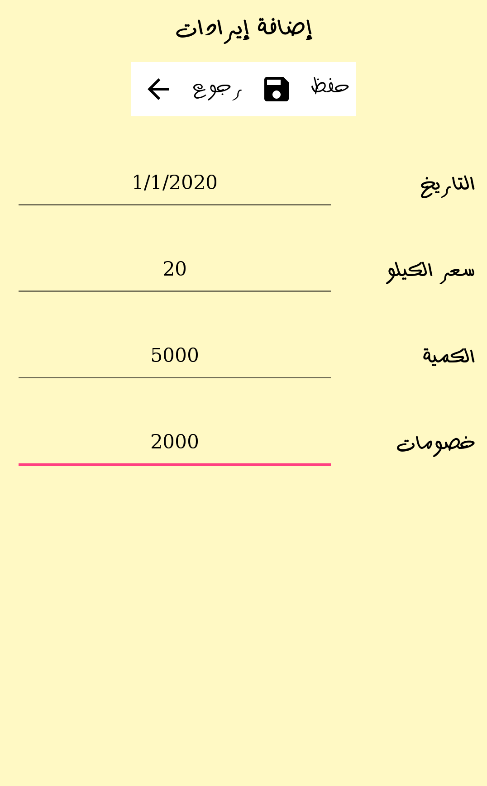

  
  
# [تطبيق إدارة المزروعات](https://play.google.com/store/apps/details?id=myfarm.ma7moud3ly.com) 

يأتي لك  بواجة بسيطة  وجداول فعالة تساعدك علي إدارة مزرعتك وحساب المصروفات و الإيرادات لكل زراعة وحقل علي حده
 
مع هذا التطبيق تستغني تماماً عن الحسابات الصعبة يدوياً أو برامج إدارة الجداول المعقدة

#### مميزات التطبيق
<li>
 يمكنك إضافة عدد غير محدود من الزراعات عن طريق (إضافة زراعة) حيث تقوم بتحديد الاسم وعدد الأفدنة
</li> 
<li>
يمكنك الدخول لجدول المصروفات لتحديد المصروفات التالية (عمالة ثابتة، عمالة متغيرة، آلات، خدمة أرض، تسميد، مبيدات حشرية، شبكة ري، كهرباء، محروقات، تقاوي وحبوب، مصاريف نقل ومصروفات نثرية)
</li>
<li> 
تقوم بتحديد تاريخ لكل عملية إضافة ويقوم التطبيق بحساب المصروفات الكلية لهذه الزراعة
</li> 
<li> 
تستطيع أيضاً حساب إيرادات الزراعات المضافة مسبقاً عن طريق جدول الإيرادات حيث تحدد (سعر الكيلو، الكمية، الخصومات)
</li>
<li> 
يقوم التطبيق بحساب الإيرادات مع تاريخ معين أوحساب الإيرادات الكلي
</li>

 

  
  
  
  

 

  
  
  
  

 
[Download From Google Play](https://play.google.com/store/apps/details?id=myfarm.ma7moud3ly.com) 

